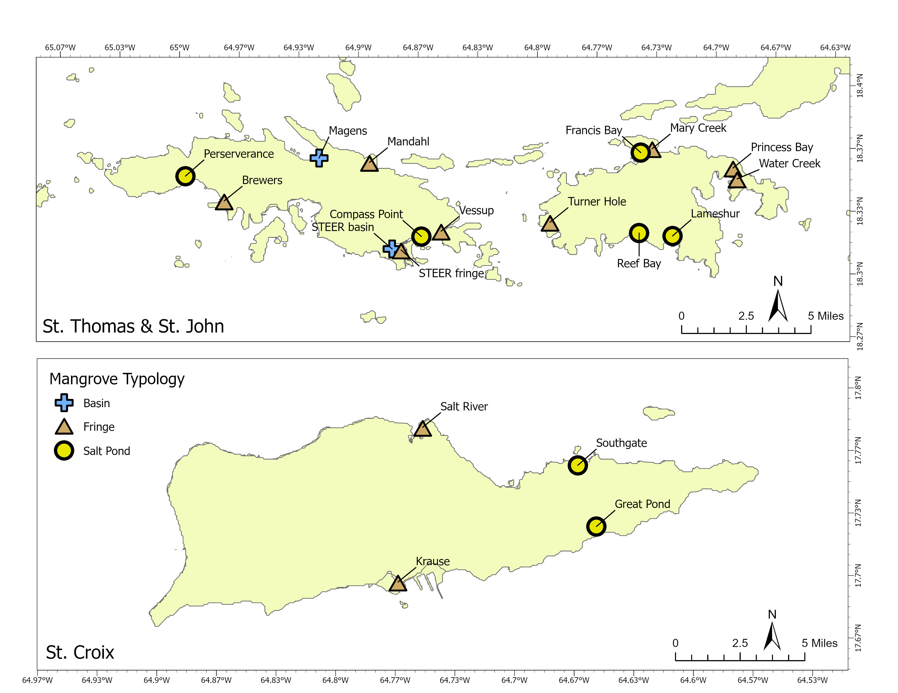

```{=html}
<style type="text/css">
.main-container {
  max-width: 85% !important;
  margin: auto;
}
</style>
```

```{r setup, include=FALSE}
knitr::opts_chunk$set(warning = FALSE, message = FALSE, echo = F)
# Needed Libraries
library(tidyverse)
library(gt)
library(readxl)

# Source Plotting Functions
source("../scripts/helper_functions.R", local = knitr::knit_global())
source("../scripts/labeler.R", local = knitr::knit_global())
source("../scripts/theme_publication.R", local = knitr::knit_global())


tree_measurements <- read_xlsx("../import_data/QA_QC_TMMP_March19_2025.xlsx", sheet = "Tree measurements")
tree_heights <- read_xlsx("../import_data/QA_QC_TMMP_March19_2025.xlsx", sheet = "Tree heights")
site_coords <- read_xlsx("../import_data/QA_QC_TMMP_March19_2025.xlsx", sheet = "Coordinates")
densiometer_data <- read_xlsx("../import_data/QA_QC_TMMP_March19_2025.xlsx", sheet = "Densiometer data")
regen_data <- read_xlsx("../import_data/QA_QC_TMMP_March19_2025.xlsx", sheet = "Regeneration")
sapling_data <- read_xlsx("../import_data/QA_QC_TMMP_March19_2025.xlsx", sheet = "Sapling")
```

## **Site Map**



## **Percent Basal Change**


## **Tree Measurements**

```{r}
create_tree_measurement_table(tree_measurements = tree_measurements, tree_heights = tree_heights)
```

### DBH Size Distributions {.tabset}

#### St. Thomas {.tabset}

```{r results='asis', echo=FALSE}

island <- densiometer_data %>% 
  filter(Island =="St Thomas") %>% 
  reframe(Site = unique(Site))

for(i in island$Site) {
  
  cat("  \n#####",  i, "\n")
  
  print(site_LF(tree_measurements, site = i, bin_size = 3))
  
  cat("  \n")
}
```

#### St. John {.tabset}

```{r results='asis', echo=FALSE}

island <- densiometer_data %>% 
  filter(Island =="St John") %>% 
  reframe(Site = unique(Site))

for(i in island$Site) {
  
  cat("  \n#####",  i, "\n")
  
  print(site_LF(tree_measurements, site = i, bin_size = 3))
  
  cat("  \n")
}
```

#### St. Croix {.tabset}

```{r results='asis', echo=FALSE}

island <- densiometer_data %>% 
  filter(Island =="St Croix") %>% 
  reframe(Site = unique(Site))

for(i in island$Site) {
  
  cat("  \n#####",  i, "\n")
  
  print(site_LF(tree_measurements, site = i, bin_size = 3))
  
  cat("  \n")
}
```

## **Seedlings**

### Relative Abundance

```{r}
seedling_rel_abundance(df = regen_data)
```

### Density

```{r, out.width="80%"}
seedling_density(regen = regen_data, densio = densiometer_data)
```

## **Saplings**

Sampling density table and figure

## **Woody Debris**

Fine, medium and coarse woody debris figures

## **Densiometer**

```{r, out.width="80%"}
densiometer_chart(df = densiometer_data)
```

## **YSI**

YSI measurement table
